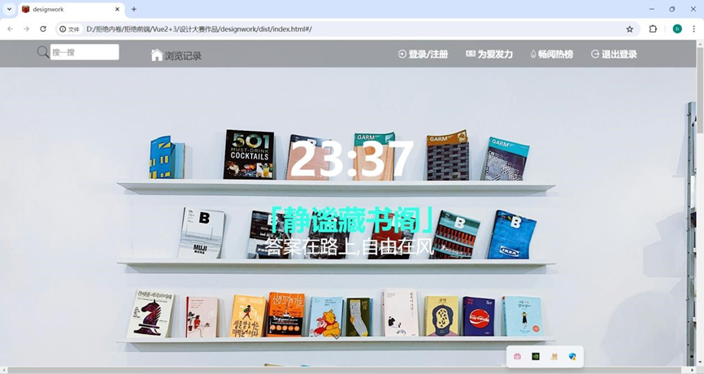
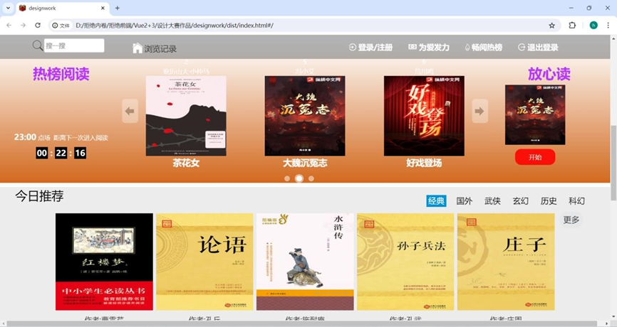
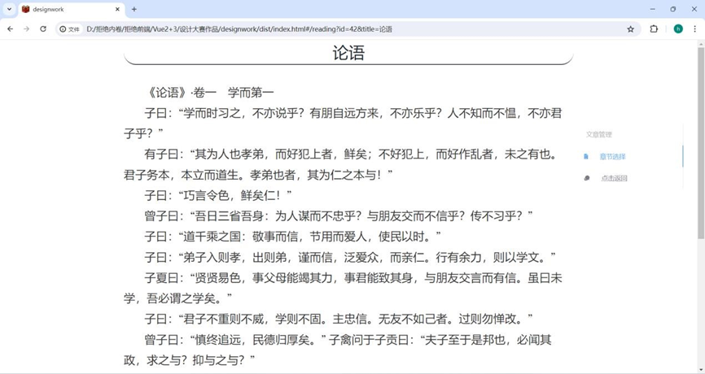

# 静谧藏书阁

注:本项目为中国计算机设计大赛参赛作品，由本人实现前端制作，最终获得省级荣誉。

项目部署地址:http: 8.134.68.12.(现已关闭)

## 项目简介

  一个优质的网络小说平台应当具备实质性的教育价值和愉悦的阅读体验。当前互联 网上存在许多关于小说的网站，存在阅读量和教育性之间的矛盾，《静谧藏书阁》小说 网致力于弥补这些不足，汇集各类小说资源，吸取优点，弥补缺陷，为读者提供沉浸式 的阅读体验。

项目内部分截图:







## 技术选型：

1. 框架选型：使用vue2.js进行前端响应式页面开发，配合原生css、html进行页面渲染
2. 脚手架选择：使用VueCli脚手架进行基本项目配置，集成Eslint，Pritter进行代码规划管理，集合WebPack进行项目的静态打包
3. 路由选择：使用vue-router进行单页面的开发，并配置axios进行路由守卫和路由拦截器的管理进一步提升页面跳转体验，同时使用token令牌防止跨站请求脚本的注入(CSRF)
4. 组件选择:Element、iView进行协同开发，打造进一步的体验效果
5. 其他：少许位置进行了媒体查询，但暂不支持移动端

## 思维构图


## 项目部署
```
npm install
```

### Compiles and hot-reloads for development
```
npm run serve
```

### Compiles and minifies for production
```
npm run build
```

### Lints and fixes files
```
npm run lint
```

## 未来展望

静谧图书馆的展望充满了无限的可能性和希望，我们立志成为读者心中的一座精神绿洲，为广大读者提供优质的阅读体验和丰富的文化享受。以下是静谧图书馆未来的瞻望： 

1. 丰富的图书资源： 我们将不断扩充图书馆的藏书规模，涵盖各个领域和类型的优质图书，包括小说、文学、历史、科普、人文社科等，满足不同读者的阅读需求。 
2. 优质的阅读体验： 我们致力于提供优质的阅读环境和服务，优化平台的用户界面和交互设计，让用户能够轻松愉悦地进行阅读，享受阅读的乐趣。 
3. 文化交流平台： 我们将打造一个文化交流的平台，举办线上线下的文化活动和阅读分享会，搭建读者之间交流互动的桥梁，促进文化的传播和交流
4. 技术创新与发展： 我们将不断引入前沿的技术手段和创新应用，包括人工智能、大数据分析等，提升平台的智能化和个性化服务水平，为用户提供更加智能、便捷的阅读体验。 
